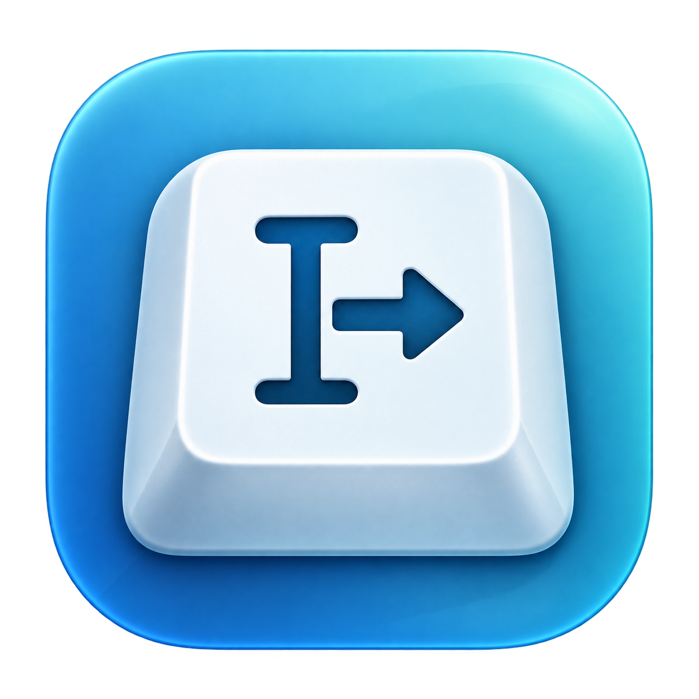

<p align="center"></p>

# TextInjector

[](https://github.com/gyeyeon385/TextInjector/actions/workflows/macos.yml)
[](LICENSE)

**[下載 v0.2.0 預覽版](https://github.com/gyeyeon385/TextInjector/releases/tag/v0.2.0)** · [安裝說明](docs/INSTALL.md) · [驗證紀錄](docs/VALIDATION-0.2.0.md)

原生 macOS SwiftUI 工具，以 CoreGraphics Unicode 鍵盤事件將文字送到 Safari。v0.2.0 支援空格、多行文字與實體 Tab 鍵；目前仍為預覽版。

## 開始使用

1. 下載 DMG，將 `TextInjector.app` 拖至「應用程式」後開啟。支援 macOS 13+，包含 Apple Silicon 與 Intel 架構（Intel 尚未硬體實測）。
2. 按「授予權限」，在「系統設定 → 隱私權與安全性 → 輔助使用」開啟 **TextInjector**。App 啟動時只檢查，不主動要求權限。
3. 按「開啟 Safari 測試頁」，點選 **B · 禁止貼上的 textarea**。
4. 回到 TextInjector，保留預設的 `Hello 世界 안녕하세요 😀`，按「輸入到 Safari」。
5. 核對測試頁顯示 `PASS · 測試文字完全一致`，且 `paste` 計數維持 0。

多行測試：按「多行與 Tab 範例」，測試頁選擇對應預期內容。實體 Tab 縮排請使用 D 區；B 區保留原生 Tab 切换焦點行為。若希望文字留在 B 區，將 App 的 Tab 行為改為「轉成 4 個空格」。

權限由系統管理。如果重新編譯、更換簽章或移動 App 後失效，請核對系統設定指向的是目前啟動的 App；必要時移除舊項目，再加入新 App。請勿同時執行交付版與 Xcode build 版。

## 本次實作

- SwiftUI 介面與 AppKit 純文字編輯器；可直接輸入 Tab，保留連續空格與空白行。提供單行／多行範例、字數、清除、固定輸入延遲與 Safari 切換延遲。
- `PermissionManager`：Accessibility / event posting 權限檢查、使用者觸發的請求、每秒重新整理狀態。
- `KeyboardInjector`：UTF-16 Unicode payload、完整 key-down / key-up 配對、清除 synthetic modifier flags。
- Unicode 以 Swift `Character` 控制節奏；超長組合字元採最多 16 UTF-16 units 的 scalar 邊界分割，不切斷 surrogate pair。
- `SafariManager`：只允許 `com.apple.Safari`，啟用已開啟的 Safari，不尋找或修改 DOM。
- `InjectionRunner`：先驗證全文，再檢查權限、切換 Safari、等待、逐事件檢查焦點與權限。支援取消與進度。
- 無文字內容日誌、分析或歷史儲存；輸入只保留於記憶體。完成訊息表示事件已發送，不表示網站已確認接收。
- 本地測試頁含普通 input、禁止 paste 的 textarea、contenteditable 及事件統計；頁面 JavaScript 僅用於觀察，不負責注入。

## 目前範圍與限制

- 換行發送實體 Return 鍵；CRLF、CR、LF、NEL、Unicode 行／段分隔符都轉成一次換行。Return 在某些網站會提交表單，請先測試目標欄位。
- Tab 預設發送實體 Tab 鍵：依網頁行為縮排或移動焦點，後續文字會輸入新的聚焦欄位。亦可選擇每個 Tab 轉成 4 個空格（不是依 tab stop 對齊）。
- Return／Tab 與相鄰文字之間至少等待 100 ms，避免網頁處理縮排與輸入的時序競爭；0 ms 文字速度也保留此等待。
- 不會自動加上結尾 Return。Backspace、Escape、NUL 等其他控制字元仍會在發送任何事件前被拒絕。
- 需先自行點選 Safari 的目標欄位。尚未偵測欄位類型或密碼欄位；若聚焦網址列，文字也可能輸入網址列。
- 原規劃使用全域 `CGEvent.post(tap:)`。本版採用 `postToPid` 將事件鎖定於已驗證的 Safari PID，以降低前景檢查與發送之間切換 App 的競爭問題；仍在每次發送前檢查 Safari 前景。不同 Event Tap 的比較測試尚未執行。
- Stop 可阻止後續發送，但無法撤回已經交給系統佇列的事件。
- 符合 Unicode payload 不等於所有網站都接受；輸入法、Safari 全螢幕、多視窗及各類網頁編輯器需實機驗證。
- Clipboard Quick Inject、Menu Bar、全域快捷鍵、開機啟動與持久設定尚未加入。
- DMG / ZIP 使用本機 ad-hoc 簽章，尚無 Developer ID 簽署與 Apple 公證；首次開啟可能被 macOS 阻擋，詳見[安裝說明](docs/INSTALL.md)。

## 開發與測試

不需要第三方套件。Xcode 16+ / Swift 6；本次實際環境為 Xcode 27.0、Swift 6.4。

```sh
open TextInjector.xcodeproj
bash scripts/build.sh
swift test
bash scripts/package.sh
```

App 執行請使用 Xcode 專案或 `build.sh` 產出的 `.app`，以保留 bundle 身分與內建 HTML 資源；Swift Package 用於核心單元測試。

專案路徑：

```text
Sources/TextInjectorCore/     Unicode payload、鍵盤事件、流程與測試介面
Sources/TextInjectorApp/      SwiftUI、PermissionManager、SafariManager、Controller
Tests/TextInjectorCoreTests/  無實際鍵盤發送的自動測試
Fixtures/safari-input.html    Safari 空格、多行、Tab 移焦與縮排驗收頁
Resources/Info.plist          App 身分與最低版本
TextInjector.xcodeproj/       原生 Xcode App 專案與共享 scheme
scripts/generate_project.py  可重建專案設定的無依賴工具
docs/VALIDATION-0.2.0.md      本版本驗證紀錄與後續檢核
```

新增 Swift 檔案後可執行 `python3 scripts/generate_project.py` 更新 Xcode sources 清單；這會重建 project 設定，請勿用它覆寫自行新增但尚未反映至腳本的設定。

Apple API 參考：[Unicode keyboard event](https://developer.apple.com/documentation/coregraphics/cgevent/keyboardsetunicodestring(stringlength:unicodestring:))、[CGPreflightPostEventAccess](https://developer.apple.com/documentation/coregraphics/cgpreflightposteventaccess())。
